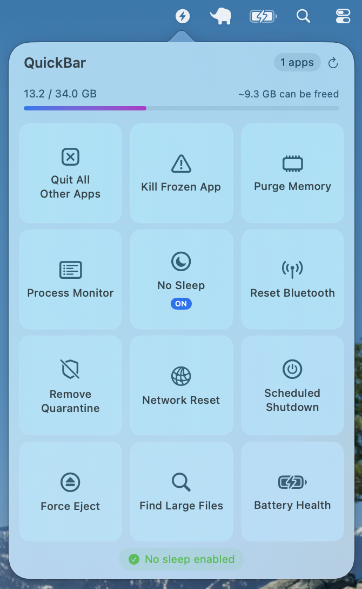
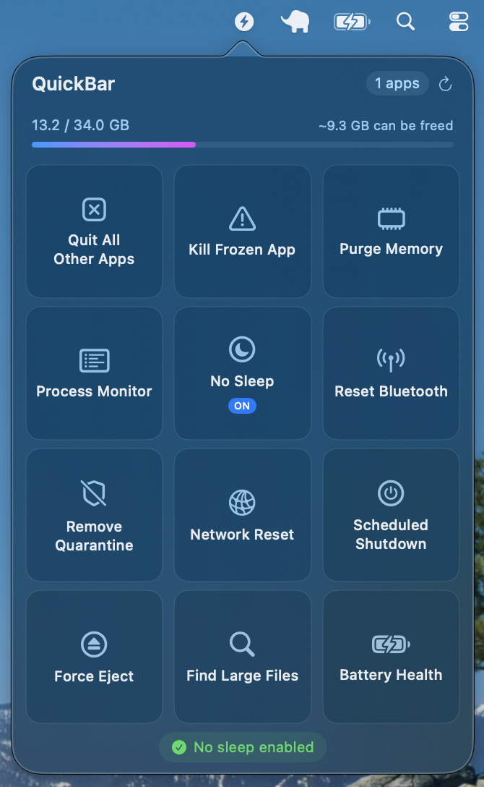

# QuickBar

A lightweight macOS menu bar app that gives you quick access to essential system utilities with a single click.

### Light Mode

### Dark Mode

## Download

[Download QuickBar.dmg](https://github.com/hamza-siddiq/QuickBar/releases)

## Features

- **Quit All Other Apps** - Close all running apps except the frontmost one
- **Kill Frozen App** - Force quit unresponsive applications
- **Purge Memory** - Free up inactive RAM to improve performance
- **Process Monitor** - View and manage background processes
- **No Sleep** - Prevent your Mac from going to sleep
- **Reset Bluetooth** - Restart Bluetooth when devices disconnect
- **Remove Quarantine** - Fix "unidentified developer" blocks on downloaded apps
- **Network Reset** - Flush DNS and renew your network connection
- **Scheduled Shutdown** - Set a timer to automatically shut down your Mac
- **Force Eject** - Safely eject stuck external drives
- **Find Large Files** - Discover files taking up disk space
- **Battery Health** - Check battery cycle count and condition

## Installation

1. Download the latest `QuickBar.dmg`
2. Open the DMG file
3. Drag `QuickBar.app` to your Applications folder
4. Launch the app — it will appear in your menu bar

## Usage

Click the ⚡ icon in your menu bar to open QuickBar. Click any tool card to run that utility. The popover automatically closes when you click outside it.

Drag and drop tool cards to rearrange them in your preferred order.

## Requirements

- macOS 13.0 or later
- Apple Silicon or Intel Mac

## License

MIT License
